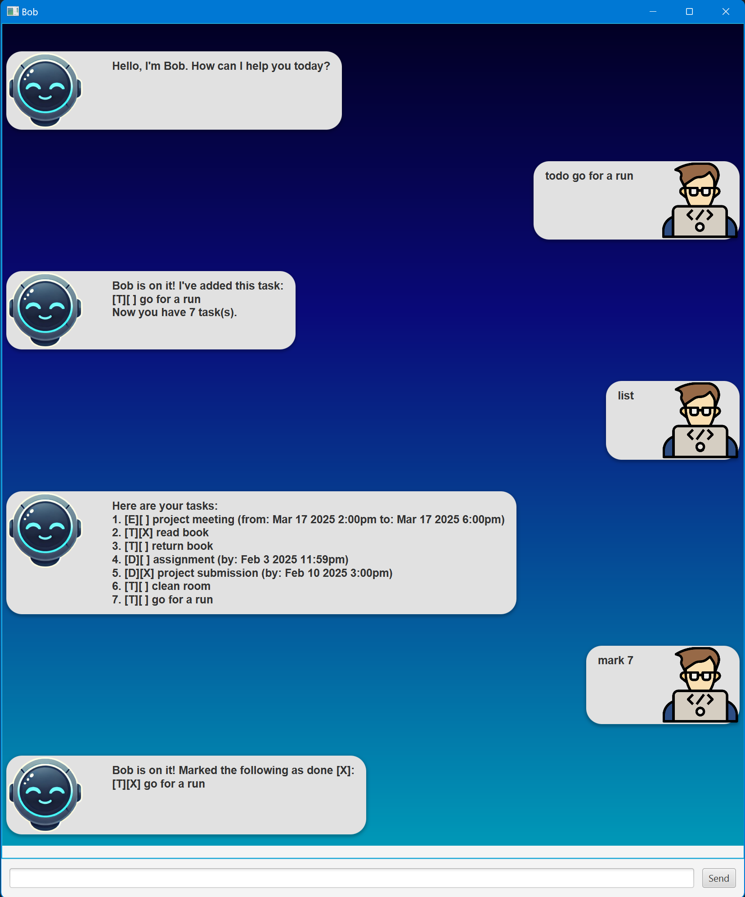

# Bob User Guide



Bob is a simple task manager for tracking Todos, Deadlines, and Events. It helps you stay organized and manage your tasks efficiently with a command-line style interface. Here's how you can use Bob:

---

## Command List

| Command                                              | Description                          |
| ---------------------------------------------------- | ------------------------------------ |
| `list`                                               | Lists all tasks.                     |
| `mark <task number>`                                 | Marks a task as done.                |
| `unmark <task number>`                               | Marks a task as not done.            |
| `delete <task number(s)>`                            | Deletes one or more tasks by number. |
| `todo <task>`                                        | Adds a Todo task.                    |
| `event <task> /from <date> <time> /to <date> <time>` | Adds an Event task.                  |
| `deadline <task> /by <date> <time>`                  | Adds a Deadline task.                |
| `find <keyword>`                                     | Finds tasks matching keyword.        |
| `bye`                                                | Exits the program.                   |

---

## Features and Usage

### 1. List Existing Tasks

Usage: `list`

This command displays all your saved tasks in the following format:

```md
Here are your tasks:

1. [E][ ] project meeting (from: Mar 17 2025 2:00pm to: Mar 17 2025 6:00pm)
2. [T][X] read book
3. [T][ ] return book
4. [D][ ] assignment (by: Feb 3 2025 11:59pm)
5. [D][X] project submission (by: Feb 10 2025 3:00pm)
6. [T][ ] clean room
7. [T][X] go for a run
```

---

### 2. Mark a Task as completed

Usage: `mark <task number>`

Example: `mark 3`

This will mark the specified task as completed. Tasks marked as done will display [X] in their status.

```md
Bob is on it! Marked the following as done [X]:
[T][X] return book
```

---

### 3. Umark a Task

Usage: `unmark <task number>`

Example: `unmark 4`

This will revert the status of a completed task to not done ([ ]).

```md
Bob is on it! Marked the following as undone [ ]
[D][ ] assignment (by: Feb 3 2025 11:59pm)
```

---

### 4. Delete task(s)

Usage: `delete <task number 1> <task number 2> ...`

Example: `delete 3 5 6`

You can delete one or multiple tasks by specifying their numbers. The task list will automatically adjust.

```md
Bob is on it! Deleted the following task(s):[T][ ] go for a run
```

---

### 5. Add a Todo Task

Usage: `todo <task>`

Example: `todo meet friend`

Adds a Todo task to your list. Todos are simple tasks without deadlines or time constraints. Your tasks list will now include the new Todo:

```md
Bob is on it! I've added this task:
[T][ ] meet friend
Now you have 10 task(s).
```

---

### 6. Add an Event Task

Usage: `event <task> /from <date> <time> /to <date> <time>`

Example: `event project meeting /from 18/02/2025 1400 /to 18/02/2025 1600`

Adds an Event to your task list, specifying a start and end date and time.

Here are your tasks:

```md
Bob is on it! I've added this task: /to 18/02/2025 1600
[E][ ] project meeting (from: Feb 18 2025 2:00pm to: Feb 18 2025 4:00pm)
Now you have 11 task(s).
```

---

### 7. Add a Deadline Task

Usage: `deadline <task> /by <date> <time>`

Example: `deadline assignment 3 /by 21/02/2025 2359`

Adds a Deadline task to your list with a specific due date and time.

```md
Bob is on it! I've added this task:
[D][ ] assignment 3 (by: Feb 21 2025 11:59pm)
Now you have 12 task(s).
```

---

### 8. Find task(s)

Usage: `find <keyword>`

Example: `find assignment`

Searches for tasks containing the given keyword and lists the results. Note only single keywords are allowed (for now).

```md
Here are your tasks:

1. [D][ ] assignment (by: Feb 3 2025 11:59pm)
2. [D][ ] assignment 3 (by: Feb 21 2025 11:59pm)
```

---

### 9. Exit the Program

Usage: `bye`

Simply exits the program, shortly after giving a goodbye message. Alternatively, you can close the window normally in Windows/macOS/Linux by clicking the 'X' manually.

Note that user progress is saved after every command automatically. If there is an error, the program will inform the user immediately.

```md
Thank you and goodbye
```
